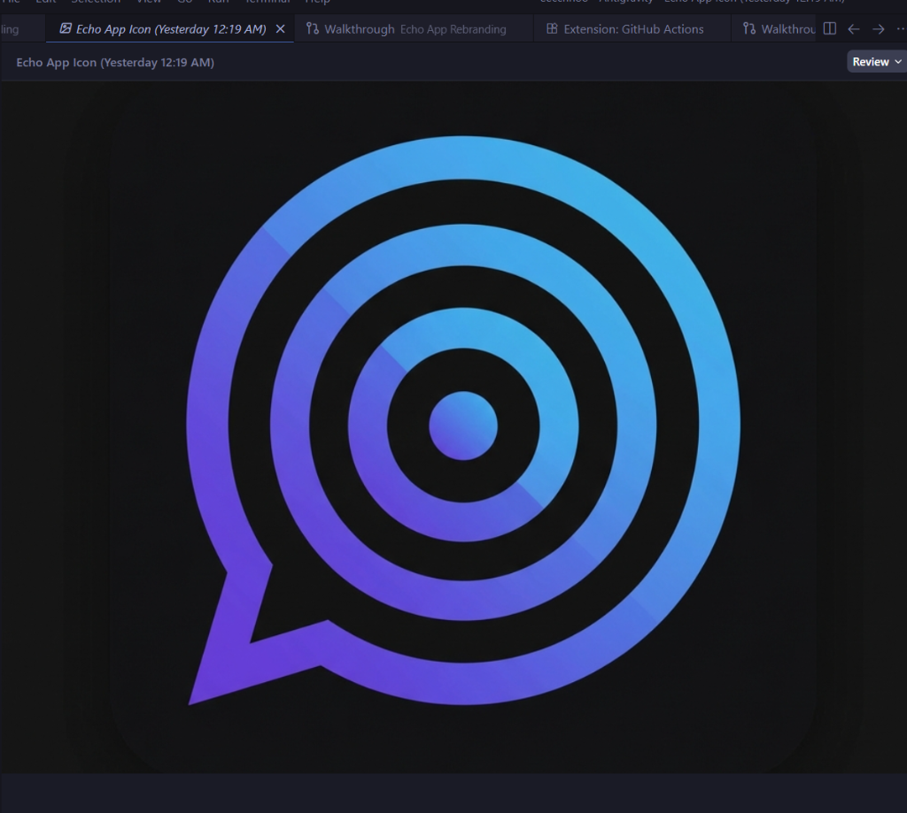

<p align="center">
    
</p>

# Echo - Decentralized Mesh Messaging App

> **Mobile Application Development Project**  
> 2nd Year, 1st Semester

## 📱 Project Overview

Echo is an Android messaging application that enables peer-to-peer communication using Bluetooth mesh networking. The app allows users to send messages without requiring internet connectivity, making it useful for scenarios where traditional networks are unavailable.

## ✨ What I Accomplished

### Core Features Implemented

- **Bluetooth Mesh Networking** - Devices automatically discover and connect to nearby peers
- **End-to-End Encryption** - Messages are secured using industry-standard cryptography (X25519 + AES-256-GCM)
- **Private & Channel Messaging** - Users can send direct messages or participate in topic-based group chats
- **Offline Message Delivery** - Store-and-forward mechanism caches messages for offline users
- **Username Setup** - First-launch prompt for users to set their nickname
- **Modern UI Design** - Custom dark theme with sleek aesthetics using Jetpack Compose

### Technical Highlights

| Component | Technology Used |
|-----------|-----------------|
| UI Framework | Jetpack Compose with Material Design 3 |
| Architecture | MVVM (Model-View-ViewModel) |
| Networking | Bluetooth Low Energy (BLE) |
| Encryption | BouncyCastle (X25519, Ed25519, AES-GCM) |
| Async Operations | Kotlin Coroutines |
| Data Storage | EncryptedSharedPreferences |

### Key Accomplishments

1. **Custom Theme System** - Designed and implemented a sleek dark color scheme with cyan accents
2. **Onboarding Flow** - Built complete permission handling and username setup screens
3. **Mesh Protocol** - Implemented multi-hop message routing with TTL-based delivery
4. **Security Features** - Integrated end-to-end encryption for all private communications
5. **Battery Optimization** - Adaptive power management for background operation

## 🛠️ Technologies Used

- **Language**: Kotlin
- **UI**: Jetpack Compose
- **Minimum SDK**: Android 8.0 (API 26)
- **Build System**: Gradle with Kotlin DSL

## 📋 Permissions Required

| Permission | Purpose |
|------------|---------|
| Bluetooth | BLE mesh communication |
| Location | Required by Android for BLE scanning |
| Notifications | Message alerts |

## 🚀 How to Build

1. Clone the repository:
   ```bash
   git clone https://github.com/tijulkabir/echo.git
   ```

2. Open in Android Studio

3. Build the project:
   ```bash
   ./gradlew assembleDebug
   ```

4. Install on device:
   ```bash
   ./gradlew installDebug
   ```

## 📸 App Features

- **Decentralized Communication** - No servers required for mesh messaging
- **Privacy-Focused** - No accounts, no phone numbers needed
- **IRC-Style Commands** - Familiar commands like `/join`, `/msg`, `/who`
- **Emergency Wipe** - Triple-tap logo to clear all data instantly

## 📁 Project Structure

```
app/src/main/java/com/echo/android/
├── ui/                 # UI components and themes
├── mesh/               # Bluetooth mesh networking
├── nostr/              # Encryption services
├── onboarding/         # Permission and setup screens
├── service/            # Background services
└── util/               # Helper utilities
```

## 🎯 Learning Outcomes

Through this project, I gained practical experience in:

- Android development with Kotlin and Jetpack Compose
- Bluetooth Low Energy (BLE) programming
- Implementing cryptographic protocols
- MVVM architecture pattern
- Managing Android permissions and lifecycle
- UI/UX design with Material Design 3

## ⚠️ Note

This is an academic project developed for learning purposes. It is not intended for production use or distribution on app stores.

---

*Mobile Application Development - 2nd Year, 1st Semester*
