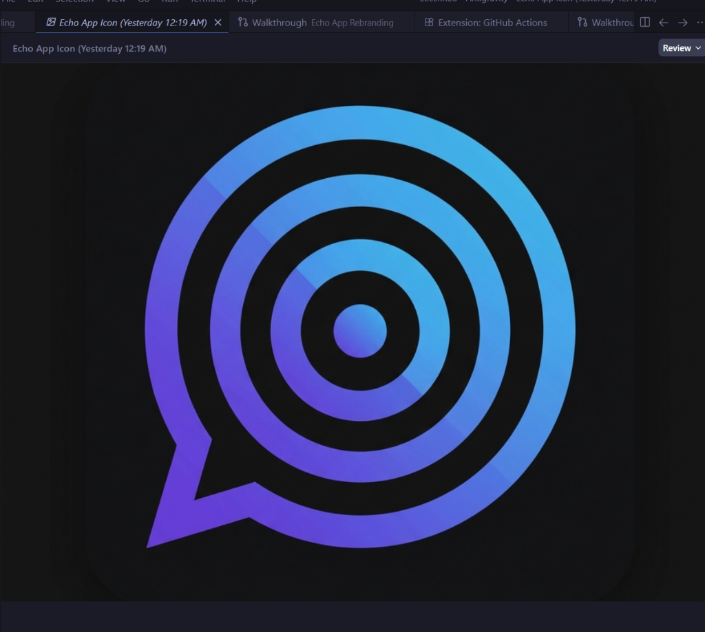

<p align="center">
    
</p>

<h1 align="center">Echo</h1>
<p align="center">Decentralized peer-to-peer messaging over Bluetooth mesh networks.</p>

---

## About

Echo is an Android messaging application that enables secure, off-grid communication using Bluetooth Low Energy (BLE) mesh networking. Messages are routed peer-to-peer without relying on cellular networks, Wi-Fi, or any centralized server infrastructure.

Built as a course project for **Mobile Application Development (CSE 3120)** during the 2nd Year, 1st Semester at United International University.

## Features

- **BLE Mesh Networking** — Multi-hop message routing over Bluetooth Low Energy. No internet required.
- **Direct Messaging** — Private 1-on-1 encrypted conversations with delivery status tracking.
- **End-to-End Encryption** — All private messages secured with the Noise Protocol Framework (X25519, AES-256-GCM).
- **Channel Messaging** — IRC-style public channels with password protection support.
- **Store-and-Forward** — Offline message caching and delivery when peers reconnect.
- **Media Sharing** — Send images, files, and voice notes over BLE.
- **Custom UI** — Material 3 design with dark/light theme support and custom branding.

## Tech Stack

| Component | Technology |
|---|---|
| Language | Kotlin |
| UI | Jetpack Compose, Material Design 3 |
| Architecture | MVVM + Coroutines & StateFlow |
| Networking | Bluetooth Low Energy (BLE) |
| Encryption | Noise Protocol, BouncyCastle |
| Build | Gradle (Kotlin DSL) |
| Min SDK | API 26 (Android 8.0) |

## Project Structure

```
app/src/main/java/com/echo/android/
├── ui/                  # Compose screens, ViewModels, theme
├── mesh/                # BLE mesh networking logic
├── service/             # Foreground service for persistent connectivity
├── protocol/            # Wire protocol definitions
├── crypto/              # Cryptographic primitives
├── noise/               # Noise Protocol implementation
├── identity/            # User profile & key management
├── features/            # Voice, file, and media modules
└── net/                 # Network utilities
```

## Build

```bash
git clone https://github.com/tijulkabir/echo.git
cd echo
./gradlew assembleDebug
```

> A physical Android device is recommended since emulators have limited BLE support.

## Architecture

Echo follows a single-activity architecture with Jetpack Compose Navigation. The networking layer runs as a foreground service (`MeshForegroundService`) to maintain persistent BLE connections in the background. State is managed through ViewModels exposing `StateFlow` to composable functions.

The encryption layer implements the Noise Protocol Framework for establishing secure channels between peers. Each device generates a unique X25519 keypair on first launch, which serves as its mesh identity.

## Attribution

The underlying mesh networking protocol and core BLE transport are based on [bitchat-android](https://github.com/permissionlesstech/bitchat-android). The application layer, UI design, direct messaging system, and custom theming were developed independently.

## License

[MIT License](LICENSE.md)
